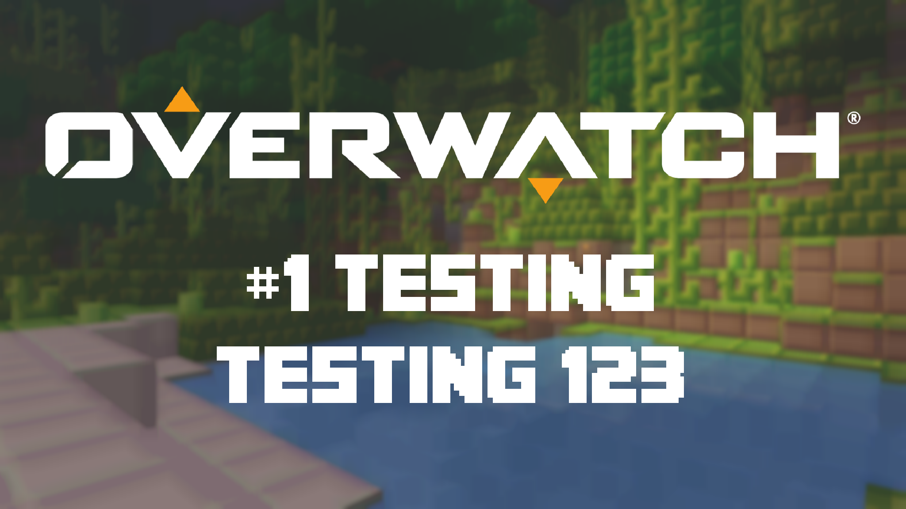

# ThumbnailCreator

This is a utility I'm creating/using for the thumbnails of my YouTube videos. It's nothing much, but makes it easier on me.

## Dependencies:

This project uses [SkiaSharp](https://github.com/mono/SkiaSharp) for the graphics

## Credits:

- Graphics library: [SkiaSharp](https://github.com/mono/SkiaSharp)
- Title font: Minecrafter_3 from [Textcraft.net](https://textcraft.net/download-fonts.php)
  - With special credit to: "Asherz08", "MadPixel", "Ashley Denham" (from License.txt)
- Overwatch logo: OW Logo White (cropped) from [Blizzard Press Center](https://blizzard.gamespress.com/Overwatch#?tab=logos)

## Additional:

[My YouTube channel](https://www.youtube.com/channel/UCk0Tq0W_gcEtZV-9xg9zm2Q/), if anyone is interested.

## Current progress:

