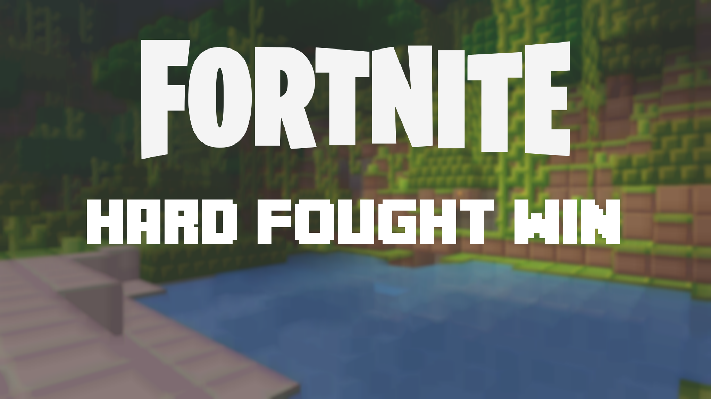

# ThumbnailCreator

This is a utility I'm creating/using for the thumbnails of my YouTube videos. It's nothing much, but makes it easier on me.

## Usage:

```bash
dotnet run -- <config name/file>
```

### Examples

Relative path to the config file
```bash
dotnet run -- "./res/Config/Counter Strike 2.config"
```

Name of included config
```bash
dotnet run -- "Counter Strike 2"
```

## Dependencies:

This project uses [SkiaSharp](https://github.com/mono/SkiaSharp) for the graphics

## Credits:

- Graphics library: [SkiaSharp](https://github.com/mono/SkiaSharp)
- Title font: Minecrafter_3 from [Textcraft.net](https://textcraft.net/download-fonts.php)
  - With special credit to: "Asherz08", "MadPixel", "Ashley Denham" (from License.txt)
- Overwatch logo: OW Logo White (cropped) from [Blizzard Press Center](https://blizzard.gamespress.com/Overwatch#?tab=logos)
- Overwatch 2 logo: Overwatch2 Secondary DKBKGD (cropped) from [Blizzard Press Center](https://blizzard.gamespress.com/overwatch-2#?tab=logos-3)
- Modern Warfare 2 logo: cod-mw2-logo from [Call of Duty MW2 Homepage](https://www.callofduty.com/modernwarfare2)
- Battlefield 2042 logo: Battlefield_2042_logo from [Wikimedia Commons](https://commons.wikimedia.org/wiki/File:Battlefield_2042_logo.svg)
- Counter Strike 2 logo: Counter Strike 2 (cropped, inverted) [Logowik](https://logowik.com/counter-strike-2-logo-vector-54963.html)
- Fortnite logo: Taken from their [home page](https://www.fortnite.com/)

## Additional:

[My YouTube channel](https://www.youtube.com/channel/UCk0Tq0W_gcEtZV-9xg9zm2Q/), if anyone is interested.

## Last Thumbnail Generated:


